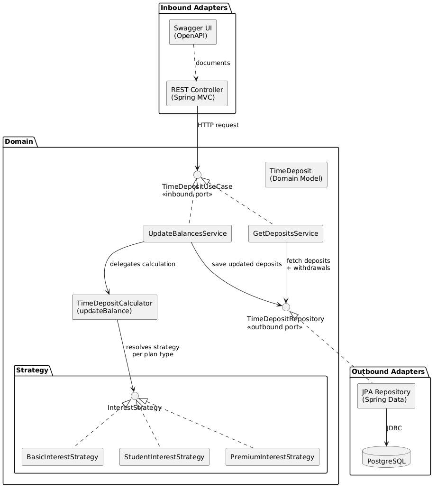

# Time Deposit System — System Design

## 1. Problem Statement

XA Bank needs a time deposit system that calculates monthly interest across plan types (Basic, Student, Premium), exposes REST
endpoints for balance updates and deposit retrieval, and persists state in PostgreSQL.

---

## 2. Functional Requirements

| ID  | Requirement                                                                          |
|-----|--------------------------------------------------------------------------------------|
| FR1 | Calculate monthly interest by plan type (Basic 1%, Student 3%, Premium 5%)           |
| FR2 | Update all deposit balances via a single API call (`POST /update-balances`)          |
| FR3 | Retrieve all deposits with associated withdrawals (`GET /time-deposits`)             |
| FR4 | Persist deposits and withdrawals in PostgreSQL (two tables)                          |
| FR5 | Enforce per-plan day rules: no interest < 30d (all), none > 365d (Student), starts > 45d (Premium) |

---

## 3. Non-Functional Requirements

| ID   | Requirement                                                            | Rationale                                        |
|------|------------------------------------------------------------------------|--------------------------------------------------|
| NFR1 | **Extensibility** — new plan type = new class, no existing code change | Open/Closed Principle via strategy pattern        |
| NFR2 | **Testability** — parameterized unit tests + Testcontainers            | Boundary-condition confidence                     |
| NFR3 | **Maintainability** — hexagonal architecture, clean layer separation   | Domain logic independent of infrastructure        |
| NFR4 | **API Documentation** — OpenAPI/Swagger                                | Self-documenting API surface                      |
| NFR5 | **Backward Compatibility** — preserve `updateBalance(List<TimeDeposit>)` | Shared contract constraint                      |
| NFR6 | **Correctness** — 2 decimal places, `HALF_UP` rounding                | Match existing calculation behavior exactly       |

---

## 4. Interest Calculation Rules

All plans: **no interest for the first 30 days**.

| Plan    | Annual Rate | Monthly Rate    | Special Rule                   |
|---------|-------------|-----------------|--------------------------------|
| Basic   | 1%          | 1% / 12         | —                              |
| Student | 3%          | 3% / 12         | No interest after day 365      |
| Premium | 5%          | 5% / 12         | Interest only starts after day 45 |

**Formula**: `interest = balance × (rate / 12)`, rounded to 2dp (`HALF_UP`)

---

## 5. Capacity Estimation (NatWest-calibrated)

> Based on public NatWest 2024 Annual Report data: 19M customers, £431B deposits, 10M+ mobile users.

| Metric | Derivation | Estimate |
|--------|-----------|----------|
| **Time deposit accounts** | £69B term deposits ÷ avg £25–35K per deposit | ~2–3M accounts |
| **GET RPS (avg)** | ~15M daily views ÷ 86,400s | **~170 RPS** |
| **GET RPS (peak)** | ~3× avg | **~500 RPS** |
| **POST RPS** | Batch job, once/month | **~0** (1 call triggers full scan) |
| **Response size** | ~200 bytes/deposit × 20 per page | **~4 KB** |
| **Peak bandwidth** | 500 RPS × 4 KB | **~2 MB/s** |
| **DB: deposits table** | 3M rows × ~50 bytes | **~150 MB** |
| **DB: withdrawals table** | Depends on history depth | **~1–5 GB** |

---

## 6. API Contract

| Method | Path | Request | Response |
|--------|------|---------|----------|
| `POST` | `/api/v1/time-deposits/update-balances` | — (no body) | `200`: `[{id, planType, balance, days, withdrawals[]}]` |
| `GET`  | `/api/v1/time-deposits` | — | `200`: `[{id, planType, balance, days, withdrawals[{id, amount, date}]}]` |

Only `200` and `500` status codes — no invalid input handling required.

### Validation Against §5 Estimates

| Endpoint | Load profile | Why it works | Potential issue |
|----------|-------------|--------------|-----------------|
| `GET /time-deposits` | 500 RPS peak × 4 KB/page = 2 MB/s | Paginated (20/page); single PG node handles 10K+ simple reads/sec — 500 RPS is ~5% capacity | Offset pagination degrades at depth — page 7500 seq-scans 150K rows (see §7 Known Problems) |
| `POST /update-balances` | ~0 RPS (once/month batch) | No throughput concern — one call, off-peak | Response returns **all** 3M deposits as JSON array ≈ 600 MB response body; should stream or omit body at scale |

---

## 7. Database Contract

**`time_deposits`**

| Column    | Type           | Constraints        |
|-----------|----------------|--------------------|
| id        | `SERIAL`       | PK                 |
| plan_type | `VARCHAR(20)`  | NOT NULL           |
| days      | `INTEGER`      | NOT NULL           |
| balance   | `DECIMAL(15,2)`| NOT NULL           |

**`withdrawals`**

| Column          | Type           | Constraints                        |
|-----------------|----------------|------------------------------------|
| id              | `SERIAL`       | PK                                 |
| time_deposit_id | `INTEGER`      | FK → `time_deposits.id`, NOT NULL  |
| amount          | `DECIMAL(15,2)`| NOT NULL                           |
| date            | `DATE`         | NOT NULL                           |

### Design Decisions (informed by §5 capacity estimates)

| Decision | Rationale |
|----------|-----------|
| **PostgreSQL (relational)** | FR3/FR4 require FK join (deposits → withdrawals) — relational model is natural fit; ~5 GB total fits single node (no sharding needed); 500 RPS reads at ~5% PG capacity; ~0 RPS writes (monthly batch) — no write-scaling concern; ACID required for financial balance mutations; native `DECIMAL` type for exact money arithmetic |
| **B-tree index on `withdrawals.time_deposit_id`** | 500 RPS peak GET × FK lookup into 1–5 GB table — B-tree keeps it under 1 ms; without it, every request seq-scans 5 GB |
| **No index on `plan_type`** | No query filters by plan type; unused index wastes ~60 MB and slows writes |
| **`SERIAL` (INTEGER) PK** | 3M deposits, ~30M withdrawals/year — exhaustion in ~70 years; `BIGSERIAL` doubles PK/FK/index size for no benefit |
| **`DECIMAL(15,2)` for money** | Exact arithmetic at DB level; max ±9.9 T covers NatWest's £431B total deposits |
| **Sequence `INCREMENT BY 50`** | HiLo pre-allocation reduces sequence round-trips from 3M to 60K when seeding |

### Known Problems at Scale

| Problem | Impact | Mitigation |
|---------|--------|------------|
| **N+1 UPDATE** — 3M individual updates × 0.5 ms ≈ 25 min | Connection pool starvation; blocks concurrent requests | Batch `UPDATE ... CASE` in chunks of 1000, or `hibernate.jdbc.batch_size=50` |
| **Full table in JVM heap** — 3M × 200 B ≈ 600 MB | GC pressure / OOM on small heaps | Stream with Hibernate `scroll()`, flush per chunk |
| **Single `@Transactional`** — 3M updates = ~150 MB WAL | Delays autovacuum; dead-tuple bloat degrades reads | Chunk into independent transactions; resume via idempotent ledger (§9 #7) |
| **Offset pagination** — page 7500 → PG discards 150K rows | Linear degradation; last page scans all 3M rows | Keyset pagination: `WHERE id > :lastId LIMIT 20` — O(1) at any depth |
| **`Double` in JPA entity** — `1000.10` → `1000.099...` | Silent rounding on DB ↔ Java round-trip | Map to `BigDecimal`; kept as `double` here to preserve original `TimeDeposit` interface |

---

## 8. Architecture



> Source: [diagram/system-design.puml](diagram/system-design.puml)

---

## 9. Future Improvements

1. **Pagination & filtering** — cursor-based pagination on `GET /time-deposits` to handle 2–3M accounts at scale
2. **Read replicas** — route GET traffic to read replicas; POST writes to primary (supports ~500 RPS read load)
3. **Caching** — Redis/Caffeine cache for deposit reads with TTL invalidation on balance updates
4. **Selective batch updates** — only recalculate eligible deposits instead of full table scan
5. **Event-driven triggers** — replace scheduled batch with domain events (e.g., Kafka) for real-time interest accrual
6. **Client-side idempotency keys** — client sends an `Idempotency-Key` header (UUID) with POST requests; server caches the response against that key (e.g. in Redis or a DB table). Same key returns the cached response without re-processing; new key or no key processes normally. Protects against network retries applying interest twice. **Limitation:** client must manage keys; in-memory cache is lost on restart; TTL means the key eventually expires. **Production-ready:** store keys in a DB table (`idempotency_keys`) instead of in-memory cache.
7. **Server-side idempotency via interest ledger** — create an `interest_ledger` table (`deposit_id`, `period` e.g. `2026-03`, `amount`, `applied_at`) with a `UNIQUE(deposit_id, period)` constraint to prevent double-processing at DB level. Query uses an anti-join to find only unprocessed deposits:
   ```sql
   SELECT td.* FROM time_deposits td
   LEFT JOIN interest_ledger il ON il.deposit_id = td.id AND il.period = '2026-03'
   WHERE il.id IS NULL;
   ```
   New deposits added mid-month get processed on next call; already-processed ones are skipped. **Partitioning for scale:** partition `interest_ledger` by `period` (monthly) so the join only scans the current month's partition. **Bonus:** full audit trail of all interest applied per deposit per month. **At billions of rows:** combine with a `last_processed_period` flag on deposits for O(1) filtering + `FOR UPDATE SKIP LOCKED` for parallel batch processing.
8. **Rate limiting & auth** — OAuth 2.0 / API key authentication + per-client rate limits
9. **Encryption at rest** — TDE or column-level encryption for balance/amount fields (PCI-DSS alignment)
10. **Circuit breaker** — Resilience4j circuit breaker on DB calls to gracefully degrade under outages
11. **Multi-region failover** — active-passive PostgreSQL replication across availability zones for DR
